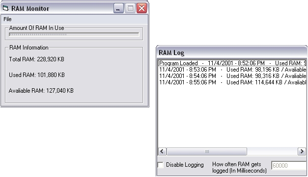



## A Great Pro RAM Monitor

### Description

This shows how much RAM you are using and how much you have left. It will also warn you if your almost out and it will log it. All the commands are optional and can be turned offand on in the program. You can also hide it and control it in the system tray.
 
### More Info
 
There are no side effects eccept it takes up about 4 MB of RAM. Thats not that much anyways.

             |
---                |---
**Submitted On**   |2001-10-18 20:39:06
**By**             |[Evil Monkey](https://github.com/Planet-Source-Code/PSCIndex/blob/master/ByAuthor/evil-monkey.md)
**Level**          |Advanced
**User Rating**    |5.0 (15 globes from 3 users)
**Compatibility**  |VB 4\.0 \(32\-bit\), VB 5\.0, VB 6\.0
**Category**       |[Complete Applications](https://github.com/Planet-Source-Code/PSCIndex/blob/master/ByCategory/complete-applications__1-27.md)
**World**          |[Visual Basic](https://github.com/Planet-Source-Code/PSCIndex/blob/master/ByWorld/visual-basic.md)
**Archive File**   |[Pro RAM Mo2981410192001\.zip](https://github.com/Planet-Source-Code/evil-monkey-a-great-pro-ram-monitor__1-28237/archive/master.zip)

